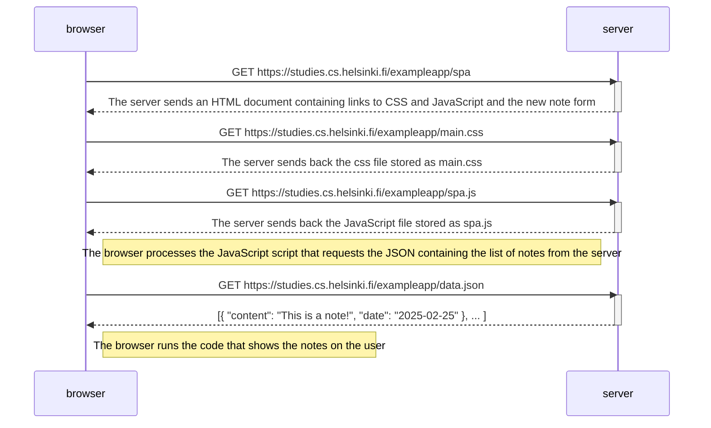

```mermaid
sequenceDiagram
    participant browser
    participant server

    browser->>server: GET https://studies.cs.helsinki.fi/exampleapp/spa
    activate server
    server-->>browser: The server sends an HTML document containing links to CSS and JavaScript and the new note form
    deactivate server

    browser->>server: GET https://studies.cs.helsinki.fi/exampleapp/main.css
    activate server
    server-->>browser: The server sends back the css file stored as main.css
    deactivate server

    browser->>server: GET https://studies.cs.helsinki.fi/exampleapp/spa.js
    activate server
    server-->>browser: The server sends back the JavaScript file stored as spa.js
    deactivate server

    Note right of browser: The browser processes the JavaScript script that requests the JSON containing the list of notes from the server

    browser->>server: GET https://studies.cs.helsinki.fi/exampleapp/data.json
    activate server
    server-->>browser: [{ "content": "This is a note!", "date": "2025-02-25" }, ... ]
    deactivate server

    Note right of browser: The browser runs the code that shows the notes on the user
```
