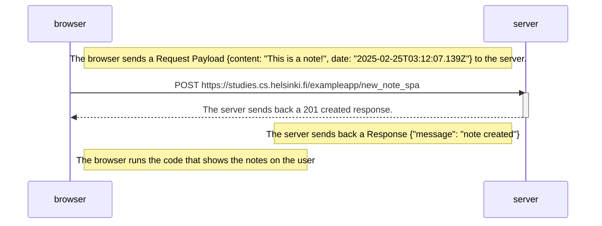

```mermaid
sequenceDiagram
    participant browser
    participant server

    Note right of browser: The browser sends a Request Payload {content: "This is a note!", date: "2025-02-25T03:12:07.139Z"} to the server.

    browser->>server: POST https://studies.cs.helsinki.fi/exampleapp/new_note_spa
    activate server
    server-->>browser: The server sends back a 201 created response.
    deactivate server

    Note left of server: The server sends back a Response {"message": "note created"}

    Note right of browser: The browser runs the code that shows the notes on the user
```
